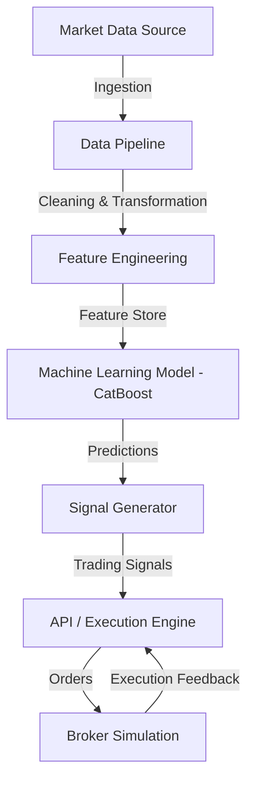

# Architecture

## Componentes Principales

1. **Data Pipeline**: Limpia y estructura los datos.
2. **Feature Engineering**: Crea indicadores técnicos.
3. **ML Model**: Genera predicciones basadas en datos históricos (CatBoost).
4. **Execution Engine (API)**: Recibe señales y expone la API.
